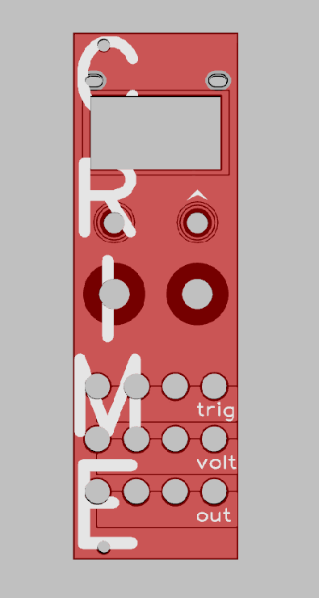
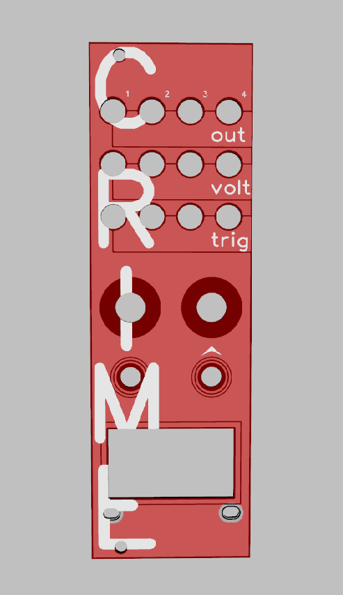

Custom panel for the micro ornament and crime (uO_c) Eurorack module. This is only the panel that is used for the uO_c.

You'll need diptrace to produce this. If you've seen this, know what it is and want gerbers, let me know and I'll add them.

uO_c by Jim Matheson, hardware and BOM at <a href="https://github.com/jakplugg/uO_C">github.com/jakplugg/uO_C</a>

Original O_c by Mxmxmx, Tim Churches, Patrick Dowling at <a href="https://github.com/mxmxmx/oc">github.com/mxmxmx/O_C</a>

Front                      |  Reversible Back of Panel
:-------------------------:|:-------------------------:
 |  

Files are my own design based on work by <a href="https://github.com/jakplugg/">@jakplugg</a> at <a href="https://github.com/jakplugg/uO_C">github.com/jakplugg/uO_C</a>.

 This work is licensed under a <a rel="license" href="http://creativecommons.org/licenses/by-nc-sa/4.0/">Creative Commons Attribution-NonCommercial-ShareAlike 4.0 International License</a>.

